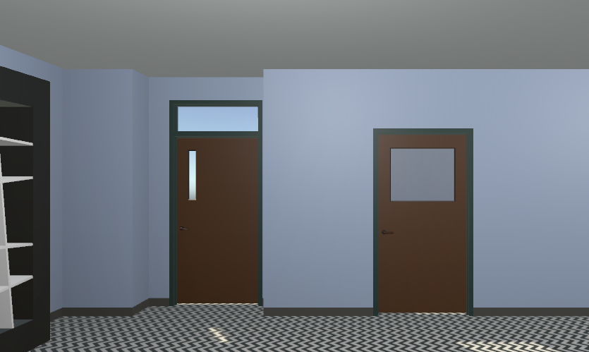
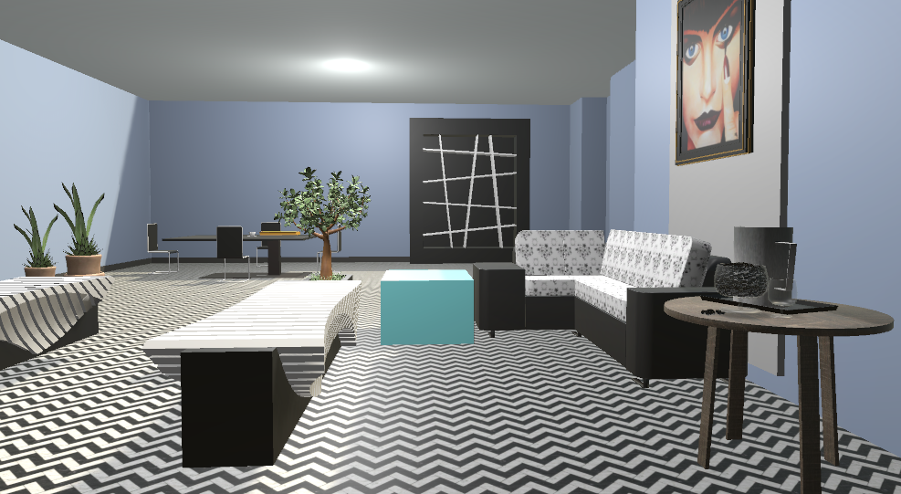
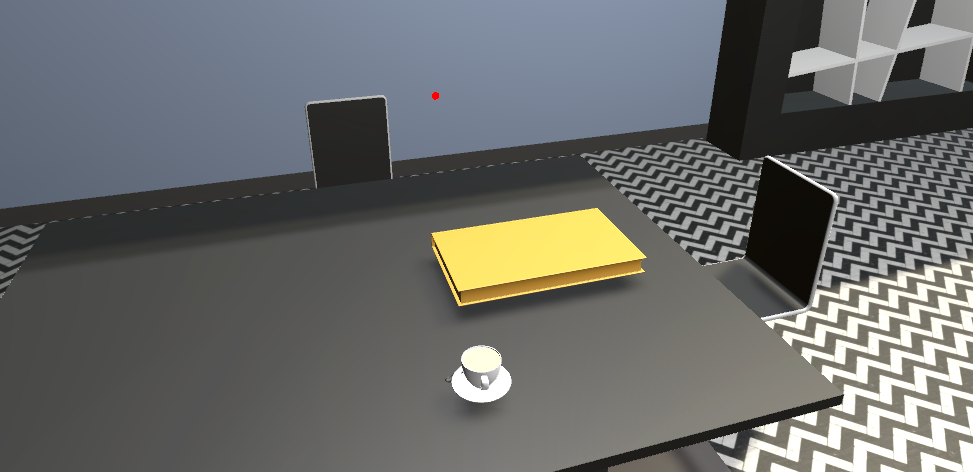
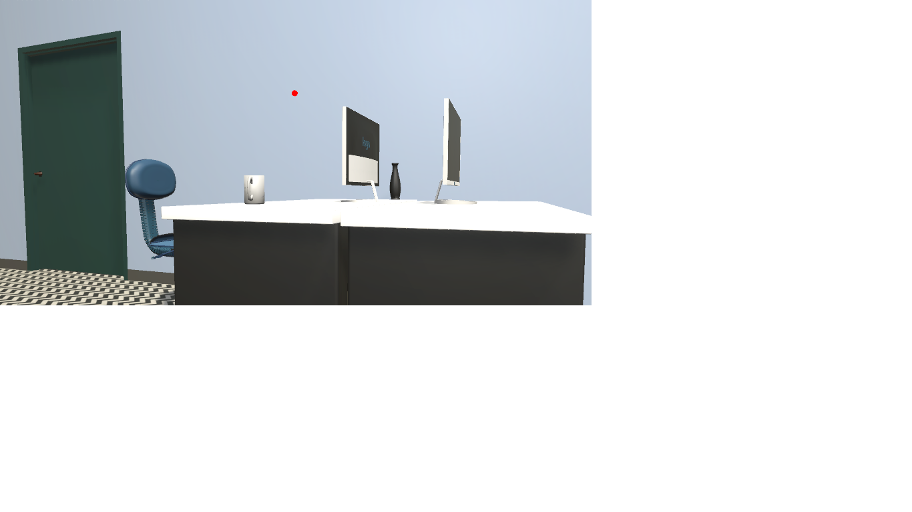
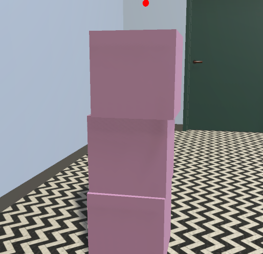
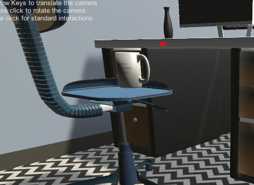

Project 3 involved designing an office where we normally have class.  It was interesting trying to find objects and designing them as well in order to fit my taste.  It was a great way to get started on unity.  For my project I added textures to the floor and walls: 
  

I created a work area, a meeting area, a fun area and a relaxation area.  
  
  
  

I was able to gather 3D object from two different online sources, turbosquid and free3d.  I did modify most of the objects too, for example for all the plants in the room, I decided I wanted the plants to be a different shade tha nthey came in so I changed the color.  Also most of the furniture in the room was wooden colored, but I did not really like the shades, so I decided to make the furniture black and white, except for the small coffee table.  In total I had 16 objects, this does not include the objects that were repeated.  
1. meeting table
2. 4 chairs for meeting table
3. book
4. cup of coffee
5. modern book shelf
6. 2 pots of plants
7. 2 desks
8. 2 office chairs
9. 2 monitors
10. vase
11. sofa
12. side table
13. 2 benches
14. coffee table
15. painting
16. blocks

Most of the small objects are interactive and can be stacked up.
  
  

Also the rolling chair makes a rolling noise when near it, it was supposed to be animated, but since I added a rigidbody, it lost the animation.  

The room looks like it could be real life, but the problem is navigating.  When moving around, it does not feel that real, when walking around it is easier to tell that some objects are not proportionate with the room, or with other objects.  It was hard to scale certain object mostly because my laptop is on the slower side, so it would get stuck a lot. 

Overall this project was a lot of fun and I am definately excied to see what I'll be making next.
