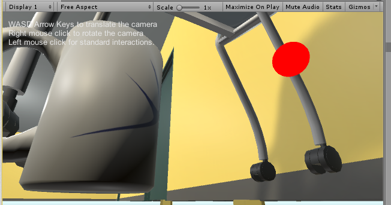

## HW3

For this homework we had to shrink ourselves as tho we were the size of a mug. As you become the size of smaller objects you can start to loose details on the surfaces.  This means that objects will look less real. It's a great way to allow the user to expirience something that they normally wouldn't.  It was interesting to see the mug suddenly cover more of the screen than it had before and that is what makes it feel more real, that other obects match to the perspective.  Even though VR is meant to be realistic, I still believe that it is also about experiencing things we are not capable of in the real world.  I think using a technique like this can be great for a game that is meant to be fictional and not so much one where things have to feel like everyday life.

