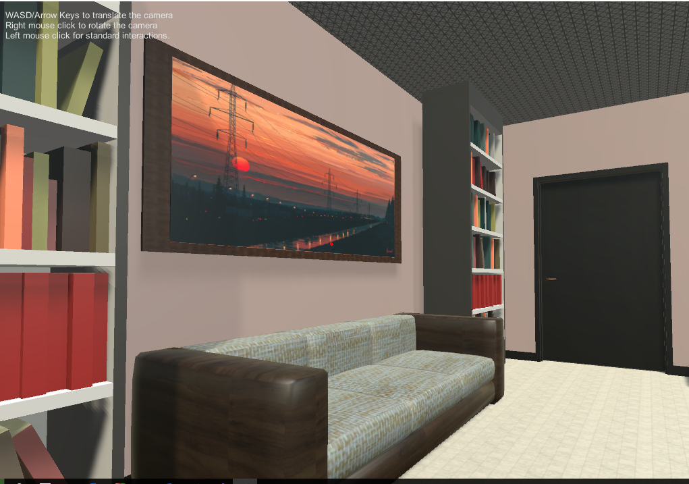
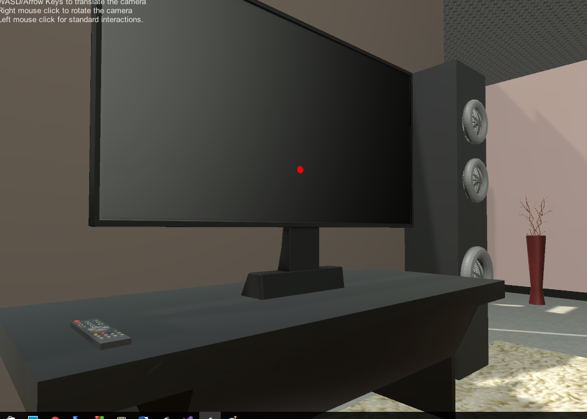
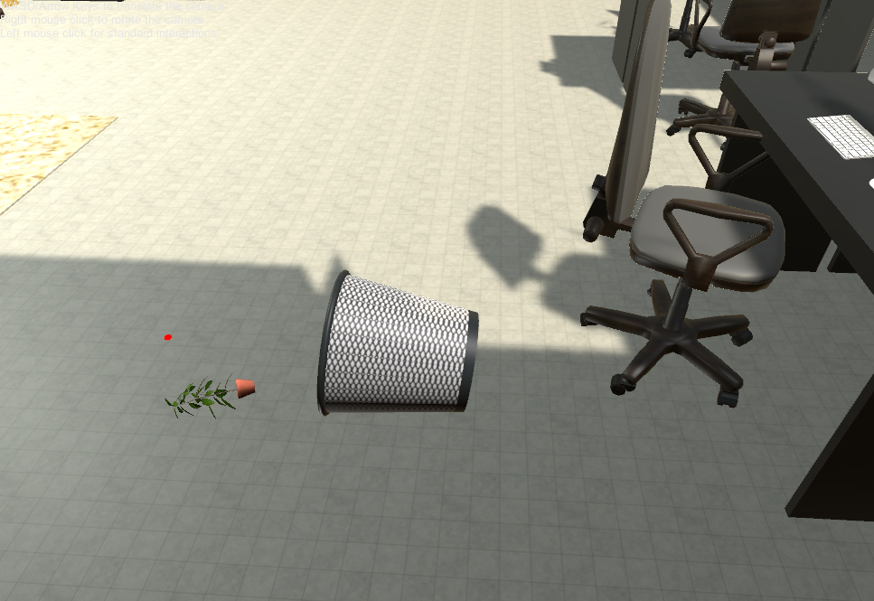
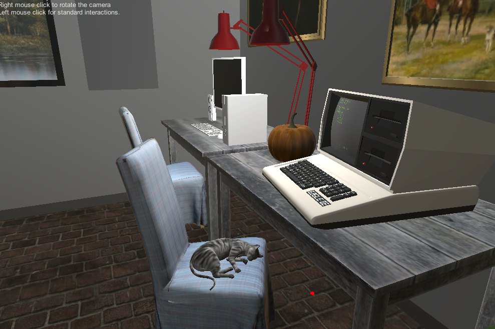
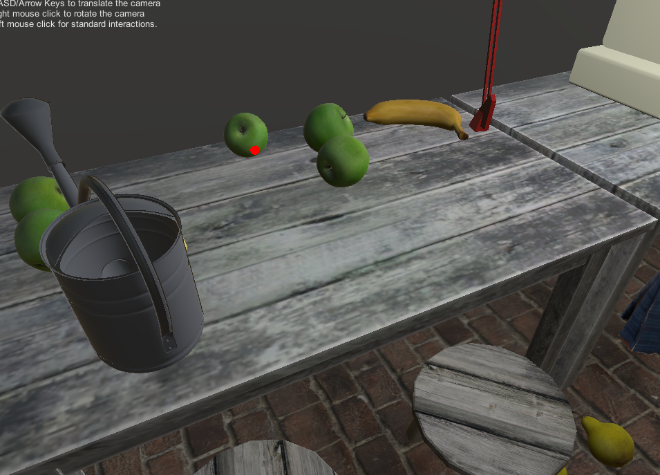

[HOME](index.md) 

## Demo Reviews  
One of the projects that I thought was relatively good was the one by Isabel Lindmae.  Her project was filled with different noises that were hear in defferent parts of the room.  I thought it was pretty creative to add audio for page turning around the book shelves.  
  
I also thought it was a little funny that the tv would play video game sounds.  
  
Pretty much everywhere you went in the room there was some type of audio, it made the room feel a bit crowded, but in reality there was no one else in the room. It was also nice how a lot of the objects were movable. While running the game, I was trying to put the garbage can on a table but as soon as the garbge can tipped I couldn't turn it back up.  
  
It could have been nice for there to be a way to turn things up.  Another nice part was the sink area because things could be put in the sink not just on top.    
  
Another really fun project was the one by Peter Hanula. His project was very amusing because it had a lot of cats which meowed or purred.  
  
The project also seemed to have a good layout, with enough space to walk around the furniture. There was also fruit in the back of the room that could be picked up and thrown, but I still wanted to pick up other object which did not have physics.  
  
Another thing that I did like was that when the lights were turned off there was glow in the dark stars on the ceiling. I thought that was very creative and different.
