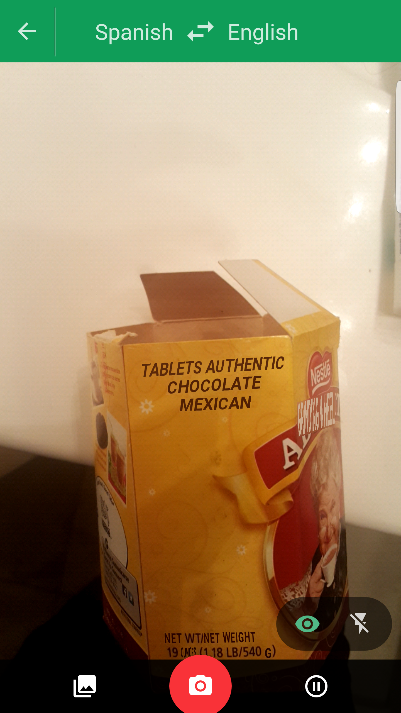

[HW1](ProsCons.md)

## Google Translate

Being able to instantly translate foreign languages into a language you can understand can be used in different ways.   Everywhere in the world there are signs, billboards, street names and many other signs with words.  If you go somewhere where you can’t understand their languages it could definitely be useful to be able to read signs and see where you are.  Another more useful way would be while working with other people that speak other languages, if working in a group sometimes you can be more comfortable working in your language and it can be possible to share paperwork written in the language you are more comfortable and have it be translated as you read.  If we lived in a world where everything would be translated to our preferred language then our social skills will be affected.  English is the most spoken language in the world and it is a way for people to interact with each other, but even if two people do not speak the same language they find a way to understand each other.  My mom and our Italian neighbor are an example of that, our neighbor does not speak English and my mom speaks both English and Spanish and somehow they manage to have conversations.  If we could easily read things in a language we understand we would stop trying to read other languages which could lead to feeling less comfortable trying to speak to others in other languages or even try to learn another language.

 

